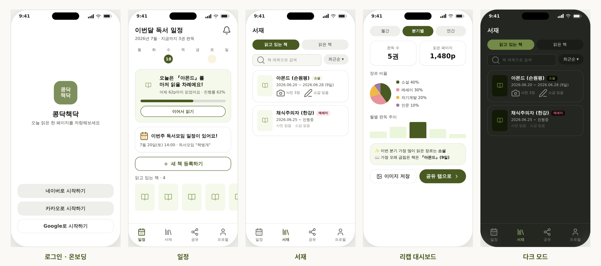
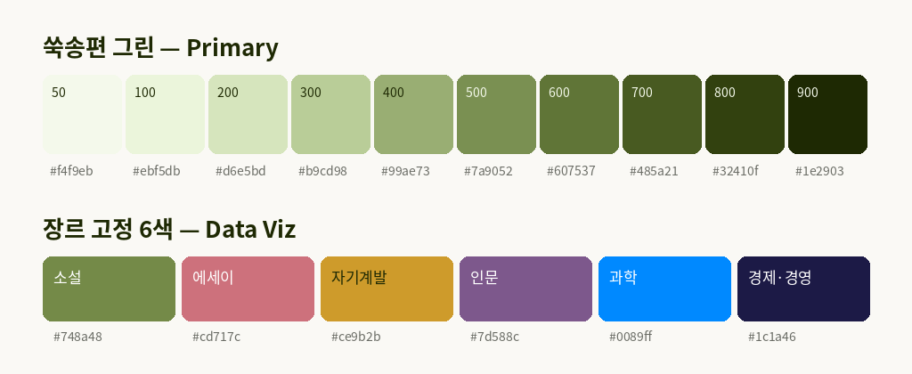

<div align="center">


# 콩닥책닥 <sub>kongdakchaekdak</sub>

**읽은 책을 기록하고, 자랑하고, 돌아보는 독서 자랑 앱** 📚

[](frontend)
[](backend)
[](backend/docker-compose.yml)
[](https://claude.com)

</div>

---

## 콩닥책닥이 뭐예요?

옛날에는 책 한 권을 다 떼면 **책거리(册禮)** 를 열어 콩송편을 나눠 먹으며 축하했습니다.
완독의 설렘, 그 **"콩닥콩닥"** 하는 마음에서 이름을 따왔어요.

운동을 마치면 "오운완"을 올리듯, 이제 독서도 취향이자 자랑이 되는 시대입니다.
그런데 정작 읽은 책을 남길 곳은 마땅치 않죠.

- 📝 기록하지 않으면 **무슨 책을 언제 읽었는지, 그때 어떤 마음이었는지** 잊어버립니다.
- 🏪 여기저기서 사고 빌린 책들을 **한 곳에 모아둘 서재**가 없습니다.
- 💬 독서 모임 오픈채팅의 소감은 대화에 **흘러가 버리고 쌓이지 않습니다.**

콩닥책닥은 **어디서 만난 책이든 하나의 서재에** 모으고, 기록의 번거로움을 앱이 대신합니다.
책 검색 한 번이면 표지·저자·쪽수가 자동으로 채워지고, 사진과 소감과 읽은 기간을 한 흐름에 남깁니다.

## 세 가지만 잘합니다

| | 핵심 가치 | 이렇게 |
|:---:|---|---|
| 📖 | **기록한다** | 시작과 완독을 남긴다. 별점·소감·사진·읽은 기간까지 한 흐름에 — *서재* |
| 🎉 | **자랑한다** | 우리끼리(그룹) 또는 모두에게(SNS·공유 링크). 시작도 자랑, 완독도 자랑 — *공유* |
| 🍃 | **돌아본다** | 분기·연간 읽은 권수와 장르 취향을 리캡으로 — *대시보드* |

## 화면 미리보기

<div align="center">

</div>

<div align="center">
<sub>Hi-Fi 목업 기준 · 전체 화면(폰·태블릿, 라이트·다크)은 <a href="design/hifi_mockup_v1.html"><code>design/hifi_mockup_v1.html</code></a>에서</sub>
</div>

## 주요 기능

- **소셜 로그인만으로 시작** — 카카오·구글·네이버. 비밀번호 없이 몇 초 안에.
- **책 검색·등록** — 알라딘 + 카카오 도서 API 이중화. 검색하면 서지정보가 자동 입력됩니다.
- **상태별 서재** — 읽을 예정 → 읽는 중 → 완독. 장르 배지와 함께 한눈에.
- **공유 카드 & 공개 웹페이지** — 공개 범위(전체/그룹/비공개)를 골라 카드 생성, 비로그인도 볼 수 있는 링크로 전달.
- **독서 그룹** — 모임 멤버에게만 소감과 모임 장소를 공유. 오픈채팅처럼 흘러가지 않고 쌓입니다.
- **리캡 대시보드** — 도넛·막대 차트로 보는 나의 독서. 그대로 공유로 이어집니다.

> 전체 기능 명세(F-01~F-12)와 화면 흐름은 [기획서](docs/콩닥책닥_기획서_v1.md)에 있습니다.

## 디자인 — 쑥송편 그린

브랜드의 뿌리가 책거리 콩송편이라, 색도 **실제 쑥송편에서 추출한 그린(hue 124.6°)** 을 씁니다.
오래 봐도 눈이 편안한, 차분하고 아늑한 톤. 라이트/다크 모드와 색약 시뮬레이션(CVD) 검증까지 마친 팔레트입니다.

<div align="center">

</div>

- 🎨 전체 컬러 시스템·컴포넌트(토스트, 다이얼로그, 스피너…): [`design/color_chips.html`](design/color_chips.html)
- 📱 22개+ 프레임 Hi-Fi 목업 (폰·태블릿, 라이트·다크): [`design/hifi_mockup_v1.html`](design/hifi_mockup_v1.html)
- ✒️ 앱 아이콘은 "콩닥/책닥" 두 줄 워드마크 — iOS 18 다크·틴트드 변형까지: [`design/app_icon.html`](design/app_icon.html)

## 기술 스택

| 영역 | 스택 |
|---|---|
| **프론트엔드** | React Native (TypeScript) · React Navigation · 소셜 로그인 SDK(카카오·네이버·구글) |
| **백엔드** | Spring Boot (Kotlin DSL Gradle) · JWT 인증 · MySQL (Docker Compose) |
| **도서 검색** | 알라딘 Open API + 카카오 도서 API — `BookSearchProvider` 인터페이스로 추상화해 교체·추가 용이 |
| **디자인** | Pretendard · Lucide Icons · 자체 디자인 시스템 (라이트/다크) |

## 저장소 구조

```
kongdakchaekdak/
├── frontend/   # React Native 앱 (TypeScript)
├── backend/    # Spring Boot API 서버
├── design/     # 디자인 시스템 소스 — 컬러칩, Hi-Fi 목업, 아이콘, 스토어 에셋
└── docs/       # 기획서 · 화면설계서 · 테이블정의서 · 테스트 시나리오/리포트 · 스크럼 로그
```

## 문서

| 문서 | 내용 |
|---|---|
| [기획서 v1](docs/콩닥책닥_기획서_v1.md) | 문제 정의 · 페르소나 · 기능 명세 F-01~F-12 · IA |
| [화면설계서 (wireframe)](docs/독서기록공유앱_화면설계서_wireframe_v2-5.html) | 전체 화면 와이어프레임 |
| [프론트 아키텍처](docs/%5Bfrontend%5D%20독서기록앱_아키텍처문서_v1.md) · [백엔드 아키텍처](docs/%5Bbackend%5D%20독서기록앱_아키텍처문서_v1.md) | 구조 설계 문서 |
| [백엔드 구축 계획](docs/독서기록앱_백엔드구축계획.md) · [TODO v2](docs/독서기록앱_TODO리스트_v2.md) | 진행 계획과 현황 |
| [개인정보처리방침](PRIVACY.md) | Privacy Policy |


