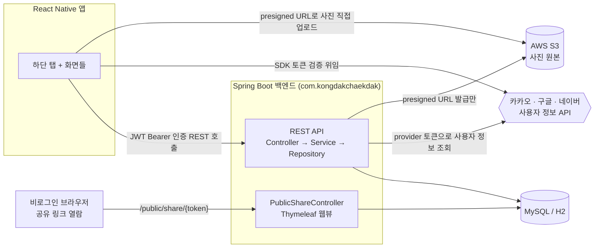
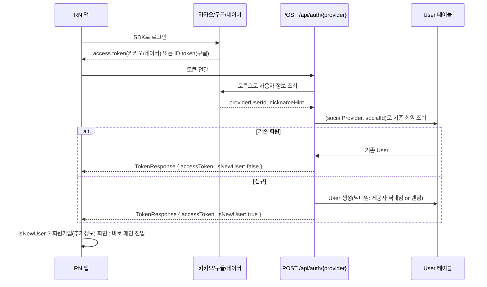
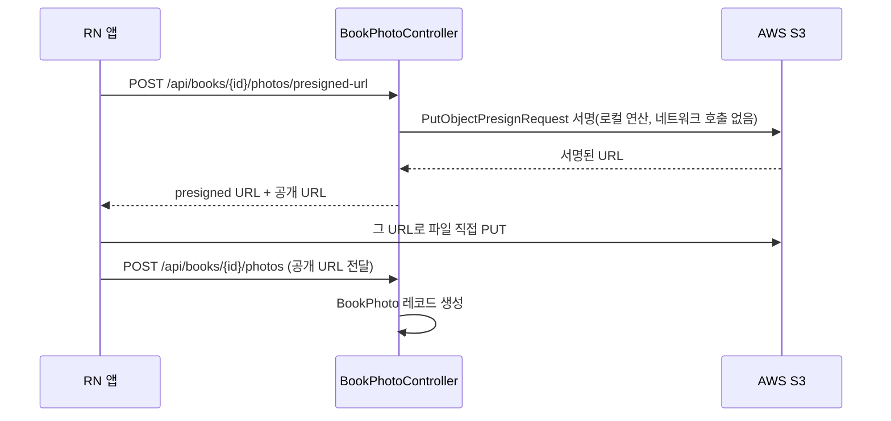
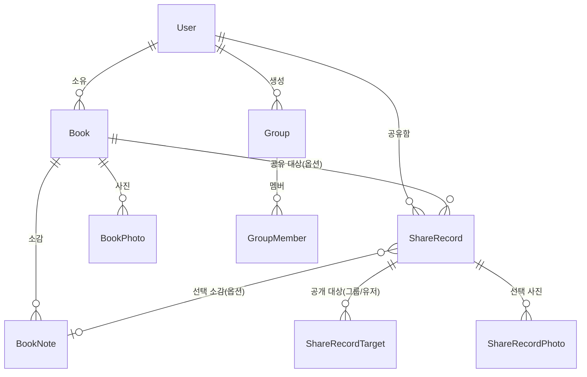

# 콩닥책닥(kongdakchaekdak) 백엔드 아키텍처 문서 v1

> 작성: 백엔드 에이전트 · 2026-08-29
> **범위와 한계**: 이 문서는 **백엔드(Spring Boot)만** 다룹니다 — 프론트엔드/디자인은 각 담당 에이전트의 별도 문서를 참고하세요. 또한 파일을 새로 읽지 않고, 이 대화 세션에서 실제로 구현·검증·리뷰한 내용을 근거로 작성했습니다. 즉 "지금 이 순간의 저장소"가 아니라 "이 세션이 알고 있는 최신 상태"의 스냅샷입니다. 정확한 최신 상태가 필요하면 코드 자체 또는 `독서기록앱_개발현황.md`를 함께 참고하세요.

---

## 1. 개요

콩닥책닥은 독서 기록을 남기고 공유하는 모바일 앱입니다. 사용자는 책을 검색해 등록하고, 사진·소감을 남기고, 독서 통계(대시보드)를 확인하고, 개별 책 또는 대시보드를 그룹/전체/커스텀 범위로 공유할 수 있습니다. 인증은 이메일/비밀번호 없이 **소셜 로그인(카카오/구글/네이버)만** 지원합니다 — 서버가 비밀번호 등 인증 정보를 직접 보관하지 않겠다는 제품 결정에 따른 것입니다.

이 백엔드(`backend/`)는 프로젝트 저장소(`D:\projects\reading-record-app`) 안의 한 영역이고, `frontend/`·`design/`은 각각 별도 에이전트가 담당합니다. 이 문서는 backend 담당 범위만 다룹니다.

## 2. 기술 스택

| 영역 | 선택 |
|---|---|
| 백엔드 프레임워크 | Spring Boot 3.2.5, Java 17, Gradle(Kotlin DSL) |
| 백엔드 패키지 루트 | `com.kongdakchaekdak` (2026-08-28, `com.bookflex`에서 IntelliJ Rename 리팩토링으로 전환) |
| DB | MySQL 8.0 (로컬 docker-compose / 운영), H2 인메모리 (`local`·`test` 프로필) |
| 인증 | JWT(jjwt 0.12.5) + 소셜 로그인 3사(카카오/구글/네이버), 이메일/PW 로그인 없음 |
| 이미지 저장 | AWS S3, presigned URL 방식(서버는 파일 자체를 중계하지 않음) |
| 공개 공유 웹뷰 | 별도 서비스 없이 Spring Boot 안에 Thymeleaf 서버 렌더링 |
| API 문서 | springdoc-openapi (Swagger UI, `/swagger-ui.html`) |
| CI | GitHub Actions (`backend-test.yml`, `backend/**` 변경 시 `./gradlew test`) |
| 배포 목표 | Railway (PORT/DB_HOST/DB_PORT/DB_NAME 환경변수 분리 완료, Gradle Wrapper 커밋 완료) |

## 3. 전체 시스템 구조

백엔드 관점에서 보면, Spring Boot 서버는 React Native 클라이언트의 REST 호출을 받고, 그와 별개로 두 종류의 외부 서비스(소셜 로그인 제공자, S3)를 서버가 직접 호출합니다. (도서 검색은 클라이언트가 알라딘/카카오 API를 직접 호출하며 백엔드를 거치지 않으므로 이 문서 범위 밖입니다.)

핵심 설계 판단 하나: **소셜 로그인은 서버가 인가 코드를 받는 방식이 아니라, 모바일 앱이 각 제공자 SDK로 이미 로그인해서 받은 토큰을 그대로 서버에 넘기고 서버는 그 토큰으로 "누구세요?"만 물어보는 방식**입니다. 카카오/네이버는 access token, 구글은 ID token을 쓰고, 서버 쪽에는 Client Secret이 필요 없습니다(구글만 `aud` 클레임을 우리 Client ID와 대조해 위조된 토큰을 걸러냅니다).

## 4. 백엔드 도메인 구조

`backend/src/main/java/com/kongdakchaekdak/domain/` 아래 도메인별 패키지로 나뉘어 있고, 각 도메인은 Controller → Service → Repository의 동일한 계층 구조를 따릅니다.

| 도메인 | 담당 | 비고 |
|---|---|---|
| `user` | 회원 CRUD, 관심분야(`interests: Set<Genre>`) | `@Table(name="users")` — USER는 MySQL 예약어라 회피 |
| `book` | 독서 기록 CRUD, 상태(READING/DONE), 장르(`Genre` enum) | |
| `bookphoto` | 책 상세 사진 업로드(S3 presigned URL 2단계 흐름) | |
| `booknote` | 책에 대한 소감, 한 책에 여러 개 작성 가능 | |
| `group` / `groupmember` | 독서모임. 소유자는 탈퇴 불가(그룹 삭제로 유도) | `@Table(name="groups")` |
| `share` | `ShareRecord`/`ShareRecordTarget`/`ShareRecordPhoto` — 책/대시보드 공유, 공개 웹뷰용 `public_token` | |
| `dashboard` | 독서 통계(Recap) 실시간 집계 — 별도 통계 테이블 없음 | |
| `auth` | `AuthController`/`AuthService`/`SocialAuthService` + `oauth2` 하위 패키지(Kakao/Google/Naver 클라이언트) | 이메일/PW 로그인 완전 삭제됨(2026-08-27) |
| `common` | 공통 예외(`GlobalExceptionHandler`), 로깅(`AuditLogger`/`SecurityEventLogger`/`RequestTraceFilter`) | |
| `security` | `JwtProvider`/`JwtAuthenticationFilter`/`JwtAuthenticationEntryPoint`/`SecurityConfig` | |
| `config` | `S3Config`(지연 빈), `OpenApiConfig`, `PublicWebConfig` | |

리소스 소유자 검증은 도메인 전체에서 같은 패턴을 씁니다: 쓰기(수정/삭제) API는 `ForbiddenException`(403)으로 본인 소유가 아니면 거부하고, 조회 API는 공유 앱 특성상 의도적으로 열어둡니다(다른 사람의 독서 기록을 구경하는 것 자체가 기능).

## 5. 인증 흐름 — 소셜 로그인 + 신규/기존 판별

`TokenResponse.isNewUser`(2026-08-29 추가)가 이 분기의 핵심입니다. 신규 가입 시 닉네임은 카카오/네이버는 제공자 프로필 닉네임을 그대로 쓰고 없으면 랜덤 생성, **구글은 현재 실제 이름이 아니라 이메일 주소가 들어가는 알려진 결함**이 있습니다(아직 미수정, 4번 표 참고).

## 6. 이미지 업로드 흐름 — presigned URL

서버는 실제 파일 바이트를 한 번도 거치지 않습니다 — presigned URL 발급은 로컬 서명 연산이라 AWS로 네트워크 요청조차 나가지 않습니다. `S3Presigner` 빈은 자격증명이 없어도 서버가 기동 실패하지 않도록 **주입 지점까지 포함해 `@Lazy`** 처리되어 있습니다(2026-08-28~29, BUG-20260827-03 대응 — `S3Config`의 빈 정의뿐 아니라 `BookPhotoService` 생성자 파라미터에도 `@Lazy`를 붙여야 실제로 지연됨).

## 7. 공개 공유 웹뷰

`ShareRecord` 생성 시 항상 `public_token`(UUID)이 발급됩니다. 로그인 없이 `/public/share/{token}`으로 접근 가능하며, `PublicShareViewService`가 엔티티를 절대 템플릿에 넘기지 않고 완전히 평탄화한 `PublicShareView` 레코드로 변환해 지연 로딩 문제를 원천 차단합니다. 책 공유는 표지/제목/선택 사진/선택 소감/완독 기간을, 대시보드 공유는 **공유 시점에 스냅샷으로 얼려 저장한** JSON(`dashboard_snapshot`)을 보여줍니다 — 나중에 데이터가 바뀌어도 공유 당시 숫자가 그대로 보이게 하기 위한 의도적 설계입니다.

## 8. 도메인 모델 요약

`ShareRecord.user_id`, `ShareRecordPhoto`, `ShareRecord.book_note_id`, `User.interests`(조인테이블 `user_interests`)는 모두 원래 테이블정의서에 없던 컬럼/테이블로, 구현 과정에서 실용적 필요에 따라 추가된 것입니다 — 원본 `독서기록앱_테이블정의서.xlsx` 반영이 아직 밀려 있습니다(4번 표 참고).

## 9. 횡단 관심사

- **로깅**: `LogType`(ACCESS/SECURITY/AUDIT/ERROR/APPLICATION) 5종을 파일로 나누지 않고 stdout + MDC(`traceId`/`logType`)로 구분 — Railway 컨테이너 파일시스템이 휘발성이라 파일 appender는 `local` 프로필에서만 켭니다. `RequestTraceFilter`가 Security 필터체인보다 먼저 실행되며 요청마다 traceId를 발급합니다.
- **예외 처리**: `GlobalExceptionHandler`가 도메인 예외(404/400/401/403/409)와 `HttpMessageNotReadableException`(잘못된 enum 값 등 → 400 `MALFORMED_REQUEST`)을 공통 `ErrorResponse` JSON으로 변환합니다. catch-all 핸들러도 있어 미처리 예외도 Whitelabel 페이지 대신 동일 포맷 500으로 나갑니다.
- **enum ↔ JSON 계약**: `Genre`(한글 라벨 그대로)와 `ShareType`/`ShareScope`/`SharePlatform`/`ShareTargetType`(소문자 영문)은 `@JsonValue`/`@JsonCreator`로 API 계약을 고정하고, DB 컬럼 매핑은 별도 `@Converter(autoApply=true)`로 독립적으로 처리합니다. **`DashboardPeriod`는 아직 이 패턴이 빠져있어 대문자만 허용**되는 불일치가 남아 있습니다.

## 10. 인프라 & 배포

- **로컬**: `docker-compose.yml`(MySQL 8.0, DB명 `kongdakchaekdak`) 또는 `local` 프로필(H2 인메모리, Docker 불필요).
- **테스트**: `test` 프로필, H2 인메모리(`kongdakchaekdak_test`), 74개 테스트.
- **CI**: GitHub Actions(`.github/workflows/backend-test.yml`) — `backend/**` push/PR마다 `./gradlew test` 자동 실행. 이 클라우드 에이전트 세션 자체는 Maven Central/Gradle Plugin Portal 접근이 막혀 있어 실제 빌드를 못 돌리기 때문에, 회귀를 조기에 잡기 위해 2026-08-29에 추가.
- **배포 목표**: Railway. `server.port`(`${PORT:8080}`), `datasource.url`(`DB_HOST`/`DB_PORT`/`DB_NAME` 분리) 준비 완료, Gradle Wrapper 커밋 완료. 실제 배포는 아직 진행 전.

## 11. 알려진 이슈 / 기술부채

| 우선순위 | 내용 |
|---|---|
| major | 구글 소셜 로그인 신규 가입 시 닉네임 자리에 실제 이름 대신 **이메일 주소**가 들어감 |
| minor | `DashboardPeriod` enum이 대문자만 허용(다른 enum들과 계약 불일치) |
| minor | `domain/auth/oauth2/` 4개 파일에 소셜 로그인 실패(`oauthProviderError`) 로깅 미반영 |
| minor | 잘못된 enum 값 응답이 필드 단위 에러 메시지(`fieldErrors`) 없이 제네릭 메시지만 반환 (OBS-06) |
| — | `독서기록앱_테이블정의서.xlsx`에 구현 중 추가된 컬럼/테이블(§8 참고) 미반영 |
| — | 로컬/Railway 기존 DB가 DB명 변경(`reading_record_app`→`kongdakchaekdak`)으로 고아가 됨 — 마이그레이션 안내 필요 |

---

*이 문서는 claude.ai 프로젝트에 `claude/독서기록앱_아키텍처문서_v1.md`로도 저장되어 있습니다. 실제 코드가 바뀌면 이 문서도 함께 갱신이 필요합니다 — 특히 §11은 시간이 지나면 빠르게 stale해질 항목들입니다.*
