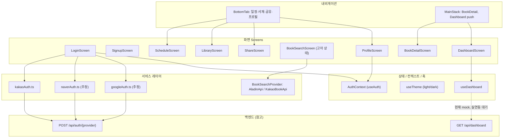
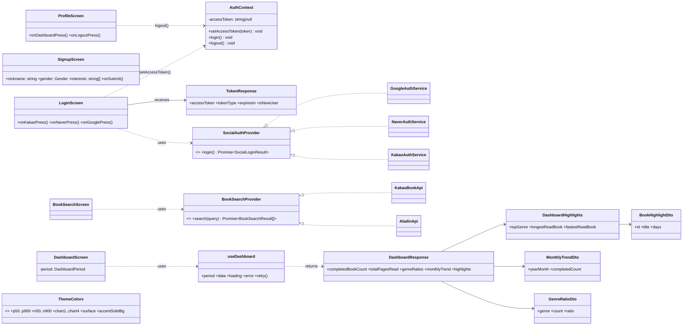

# 콩닥책닥(kongdakchaekdak) 프론트엔드 아키텍처 문서 (v1)

> 작성: 프론트엔드 에이전트 · 2026-08-31
> 범위: `frontend/`(React Native + TypeScript) — 백엔드/디자인은 참고로만 언급
> 근거: 프로젝트 문서(설계·요청·답변 기록) — 10장 "근거 문서" 참고

## 0. 요약

콩닥책닥 프론트는 React Native 단일 앱으로, 화면(Screens) → 내비게이션(Navigation) → 상태/훅(Context·Hooks) →
서비스(Services) → (아직 대부분 mock인) 백엔드 API 순서의 전형적인 레이어 구조를 따른다. 로그인/회원가입,
일정, 서재, 서재상세, 공유, 프로필, 독서 대시보드(Recap) 7개 화면이 구현되어 있고, 책 검색 화면은 만들어져
있지만 내비게이터에 연결되지 않은 고아 상태다. 소셜 로그인(카카오/네이버/구글) SDK 연동과 `isNewUser` 분기는
완료되었고, 프로필/대시보드는 mock 데이터로 UI까지 완성되어 실제 API 연동만 남아 있다.

## 1. 레이어 구조



## 2. 화면 인벤토리

| 화면 | 파일(추정 경로) | 상태 | 비고 |
|---|---|---|---|
| 로그인 | `screens/LoginScreen.tsx` | 구현 완료 | 카카오/네이버/구글 SDK 실연동, `isNewUser` 분기 완료 |
| 회원가입 | `screens/SignupScreen.tsx` | 구현 완료(로컬 state) | 닉네임 필수, 성별, 관심분야 다중선택, 독서모임 검색·연결 — 관심분야는 백엔드 스키마 추가 요청됨 |
| 일정(홈) | `screens/ScheduleScreen.tsx` | 구현 완료(mock) | Frame 02 |
| 서재 | `screens/LibraryScreen.tsx` | 구현 완료(mock) | Frame 03, "새 책 등록하기" 버튼 핸들러 미연결 |
| 서재 상세 | `screens/BookDetailScreen.tsx` | 구현 완료(mock) | Frame 03.1, `MainStack` push |
| 책 검색 | `screens/BookSearchScreen.tsx` | **고아 상태** | 내비게이터 어디에도 연결 안 됨 |
| 공유 | `screens/ShareScreen.tsx` | 구현 완료(버튼 일부 미작동) | Frame 04, 앱 내 공유/SNS 공유 버튼 미작동 |
| 프로필 | `screens/ProfileScreen.tsx` | 구현 완료(mock) | Frame 05, 대시보드 진입·로그아웃은 실연결, 프로필 편집만 미연결 |
| 독서 대시보드(Recap) | `screens/DashboardScreen.tsx` | 구현 완료(mock) | Frame 05.1, `MainStack` push, 기간 토글(월/분기/연) |

## 3. 내비게이션 구조

- **BottomTab**: 일정 / 서재 / 공유 / 프로필 4개 탭
- **MainStack**: 탭바 없이 위에서 push되는 화면들 — `BookDetailScreen`, `DashboardScreen`
- `navigation/types.ts`에 라우트별 파라미터 타입 정의(예: `Dashboard: undefined`)
- 로그인 전/후 내비게이터 분리는 `AuthContext`의 인증 상태에 따라 로그인 스택 ↔ 메인(Tab+Stack)을 조건부
  렌더링하는 일반적인 RN 패턴을 따른다.

## 4. 상태 관리

- **AuthContext / `useAuth()`**: `accessToken`, `setAccessToken()`, `login()`, `logout()` 제공.
  **세션 영속화가 없음** — 앱을 완전히 종료했다 다시 열면 로그아웃 상태로 초기화된다(테스터 시나리오
  FE-SL-04~06이 바로 이 특성을 이용해 재로그인 케이스를 재현함).
- **`useTheme()`**: `ThemeColors` 인터페이스(34개 키) 기준 라이트/다크 팔레트 전환. 컬러 팔레트가 v1.2 →
  v2("책거리×송편")로 리브랜딩되면서 라이트+다크 전체 토큰 동기화가 2026-08-27에 완료됨(8장 참고).
- **`useDashboard()`**: 기간(`month`/`quarter`/`year`) 상태 + mock fetch(400ms 지연으로 로딩 스켈레톤 재현) +
  `error`/`retry` 관리. 실제 `GET /api/dashboard` 연동 시 내부 fetch 함수만 교체하면 되는 구조로 설계됨.

## 5. 서비스 레이어

### 5.1 소셜 로그인

| 프로바이더 | 파일 | SDK | 비고 |
|---|---|---|---|
| 카카오 | `services/socialAuth/kakaoAuth.ts` | `@react-native-seoul/kakao-login` v6.0.4 | 사용자 취소를 구분하는 전용 에러 코드가 없어 취소도 "로그인 실패"로 처리됨(설계상 알려진 제약) |
| 네이버 | `services/socialAuth/naverAuth.ts`(추정) | 네이버 로그인 SDK | 취소 시 조용히 로그인 화면 복귀 |
| 구글 | `services/socialAuth/googleAuth.ts`(추정) | 구글 Sign-In | 취소 시 조용히 로그인 화면 복귀 |

세 서비스 모두 `POST /api/auth/{provider}`에 카카오/네이버는 `accessToken`, 구글은 `idToken`을 실어 보내고,
응답(`TokenResponse`: `accessToken`, `tokenType`, `expiresIn`, `isNewUser`)의 `isNewUser`로 회원가입 화면
진입 여부를 분기한다(6장 참고).

### 5.2 도서 검색 — `BookSearchProvider`

알라딘 Open API와 카카오 도서 검색 API 두 곳을 공통 인터페이스(`BookSearchProvider`, `search(query)` 형태로
추정)로 추상화하고, `AladinApi`/`KakaoApi` 두 구현체를 두는 구조다. TODO 리스트의 "두 도서 API(알라딘/카카오)
결과 병합·중복 제거 로직 검증"(7장) 항목이 이 레이어와 연결된다.

## 6. 데이터 타입 (DTO)

```ts
// 인증
interface TokenResponse {
  accessToken: string;
  tokenType: 'Bearer';
  expiresIn: number;
  isNewUser: boolean; // true=신규가입, false=기존 로그인
}

// 대시보드
type DashboardPeriod = 'month' | 'quarter' | 'year';
type DashboardPeriodResponse = 'MONTH' | 'QUARTER' | 'YEAR';

interface GenreRatioDto { genre: string; count: number; ratio: number; }
interface MonthlyTrendDto { yearMonth: string; completedCount: number; }
interface BookHighlightDto { id: number; title: string; days: number; }
interface DashboardHighlights {
  topGenre: string | null;
  longestReadBook: BookHighlightDto | null;
  fastestReadBook: BookHighlightDto | null;
}
interface DashboardResponse {
  userId: number;
  period: DashboardPeriodResponse;
  periodLabel: string;
  startDate: string;
  endDate: string;
  completedBookCount: number;
  totalPagesRead: number;
  genreRatios: GenreRatioDto[];
  monthlyTrend: MonthlyTrendDto[];
  highlights: DashboardHighlights;
  recommendedCaption: string;
}
```

## 7. 클래스 다이어그램



## 8. 테마 시스템

- `theme/colors.ts`: `ThemeColors` 인터페이스(34개 키) — `p50~p900`(프라이머리 그린 램프), `n50~n900`(뉴트럴),
  `success`/`warning`/`error`/`info`, `chart1~chart4`(장르 도넛차트 등에 사용), `surface`, `accentSolidBg`,
  `onAccentSolid`, `warnBg`/`warnText`, `hairline`. 2026-08-27에 v1.2("잔디" 그린) → v2("책거리×송편" 그린)
  리브랜딩 전체 동기화 완료. `chart1`은 `p700`을 그대로 참조하는 토큰이다.
- `theme/typography.ts`: `FONT_FAMILY`가 아직 `undefined`라 시스템 폰트로 폴백 중 — Pretendard 폰트 파일
  번들링이 TODO로 남아 있음(디자인 요청 문서 참고).
- 장르 도넛차트 색상 규칙: 순위 기반 고정 매핑(1위=`chart1`, 2위=`chart2`, 3위=`chart3`), 4위 이하는 `chart4`가
  아니라 `n200`(무채색) 하나로 합산해 "기타"로 표시.

## 9. 알려진 미완성 / 이슈

- `BookSearchScreen`이 내비게이터에 연결되지 않은 고아 상태 — `ScheduleScreen`/`LibraryScreen`의 "새 책
  등록하기" 버튼에 핸들러 없음
- Frame 08.2(책 등록 확인 화면) 미구현
- Frame 05.2(프로필 편집), 이미지 저장(`react-native-view-shot` 연동 예정), "공유 탭으로" 연동 — 전부 버튼만
  배치, `onPress` 없음
- `GET /api/dashboard` 실제 연동 — 계약 확정, 현재는 mock
- 구글 소셜 로그인 시 닉네임 자리에 실제 이름이 아니라 **이메일 주소**가 채워지는 백엔드 버그성 동작(닉네임
  필수 입력 단계가 있어 현재는 사용자가 그 자리에서 수정 가능하지만, 근본 수정은 아직 안 됨)
- `react-native-screens` 버전 충돌 이력(`~4.8.0`으로 반영됐다고 기록되어 있으나 최신 상태 재확인 필요)
- 관심분야 → 장르 포인트 컬러 매핑(디자인 답변 대기 중이었던 항목, 이후 진행 상태 확인 필요)

## 10. 근거 문서

이 문서는 아래 프로젝트 문서에 남은 서술을 근거로 재구성했습니다(전부 프로젝트에 저장된 문서):

- `claude/독서기록앱_TODO리스트_v2.md`
- `claude/독서기록앱_개발현황_v2.md`
- `claude/독서기록앱_프론트_프로필대시보드_설계_v1.md`
- `claude/독서기록앱_프론트요청_백엔드_인증API_신규회원판별_v1.md`
- `claude/독서기록앱_백엔드요청_프론트_인증API변경_v1.md`
- `claude/독서기록앱_프론트요청_디자인시스템v2동기화_v1.md`
- `claude/독서기록앱_프론트요청_테스터_소셜로그인온보딩시나리오_v1.md`
