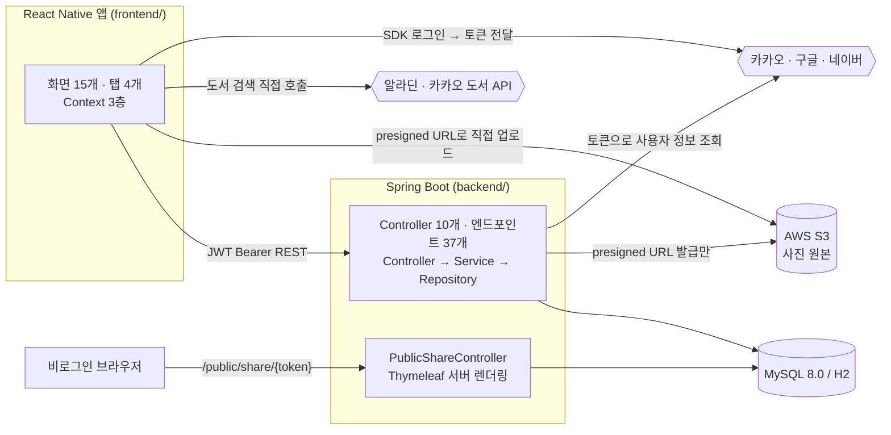

# 콩닥책닥 아키텍처 문서

> **v1 · 기준 커밋 `74974fe` (2026-09-09)**
> 이 폴더는 콩닥책닥이 **어떤 구조로 생겼는지**를 설명합니다.

## 이 문서들의 책임 경계

아키텍처 문서는 **구조**만 책임집니다. **무엇이 얼마나 됐는지**는 [`../연동매트릭스_v1.md`](../연동매트릭스_v1.md)가 단일 기준입니다.

| 질문 | 보는 문서 |
|---|---|
| 화면/도메인이 어떻게 나뉘고 무엇이 무엇을 호출하나 | 이 폴더 |
| 지금 실제로 서버와 붙어서 동작하는 기능이 몇 개인가 | `연동매트릭스_v1.md` (공식 진행률) |
| 어제 무엇을 했나 | `../scrum/` |
| 무엇이 깨져 있나 | `../test/reports/` |

이전 개정(2026-08-29 / 08-31)에서는 아키텍처 문서가 "알려진 이슈" 목록을 직접 들고 있었는데, 그 섹션이 가장 빨리 낡았습니다. 이슈 추적은 매트릭스와 테스트 리포트로 넘기고, 여기서는 **구조를 이해하는 데 필요한 만큼만** 제약을 언급합니다.

## 문서 목록

| 문서 | 범위 |
|---|---|
| [`frontend.md`](frontend.md) | `frontend/` — React Native + TypeScript |
| [`backend.md`](backend.md) | `backend/` — Spring Boot |

HTML 버전(`frontend.html` / `backend.html`)은 같은 내용을 브랜드 팔레트로 스타일링한 읽기용 사본입니다. **원본은 `.md`이고 HTML은 생성물**이므로, 수정은 항상 `.md`에 합니다.

## 시스템 한눈에 보기



구조를 규정하는 결정 네 가지입니다.

**소셜 로그인만 지원합니다.** 이메일/비밀번호 로그인은 2026-08-27에 완전히 삭제됐습니다. 서버가 비밀번호를 보관하지 않겠다는 제품 결정이고, 그 결과 백엔드에 인가 코드 교환 흐름이 없습니다 — 앱이 각 제공자 SDK로 이미 받은 토큰을 넘기면 서버는 그 토큰으로 "누구세요?"만 묻습니다.

**도서 검색은 백엔드를 거치지 않습니다.** 앱이 알라딘/카카오 API를 직접 호출합니다. 그래서 서버에는 도서 검색 도메인이 아예 없습니다.

**사진 바이트는 서버를 통과하지 않습니다.** 백엔드는 presigned URL만 발급하고, 실제 업로드는 앱 → S3 직접 PUT입니다.

**공개 공유 웹뷰는 별도 서비스가 아닙니다.** 별도 Next.js를 세우는 대신 Spring Boot 안에서 Thymeleaf로 서버 렌더링합니다.

## 저장소 구조

```
kongdakchaekdak/
├── frontend/   # React Native 앱 (TypeScript)
├── backend/    # Spring Boot API 서버
├── design/     # 디자인 시스템 소스 — 팔레트 생성/검증 스크립트, 목업, 아이콘, 스토어 에셋
└── docs/
    ├── architecture/   # ← 이 폴더
    ├── scrum/          # 일자별 스크럼 로그
    └── test/           # 시나리오 · 픽스처 · 리포트 · 요청서
```

## 갱신 규칙

파일명에 버전을 붙이지 않습니다. `연동매트릭스_v1.md`가 세운 규칙을 그대로 따릅니다 — **v1/v2는 제품 버전**이고, 문서 리비전은 헤더의 **기준 커밋**으로 식별합니다. 앱이 실제로 v2가 될 때만 문서 제목의 v1을 올립니다.

구조가 바뀌는 커밋(도메인 추가, 내비게이터 재편, 레이어 신설)에서는 이 폴더도 같은 PR에서 갱신합니다. 기능 진행 상황만 바뀐 경우에는 매트릭스만 갱신하면 되고 여기는 건드리지 않습니다.
