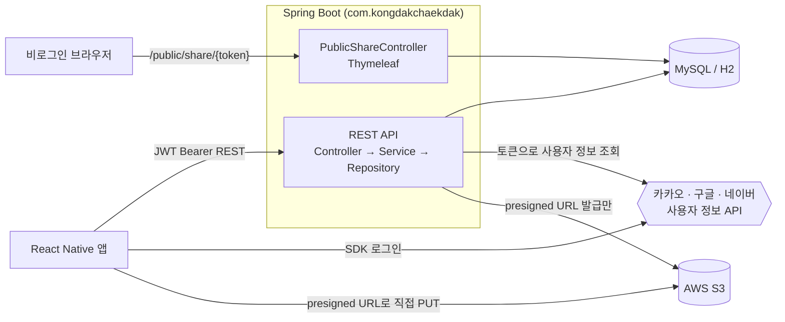
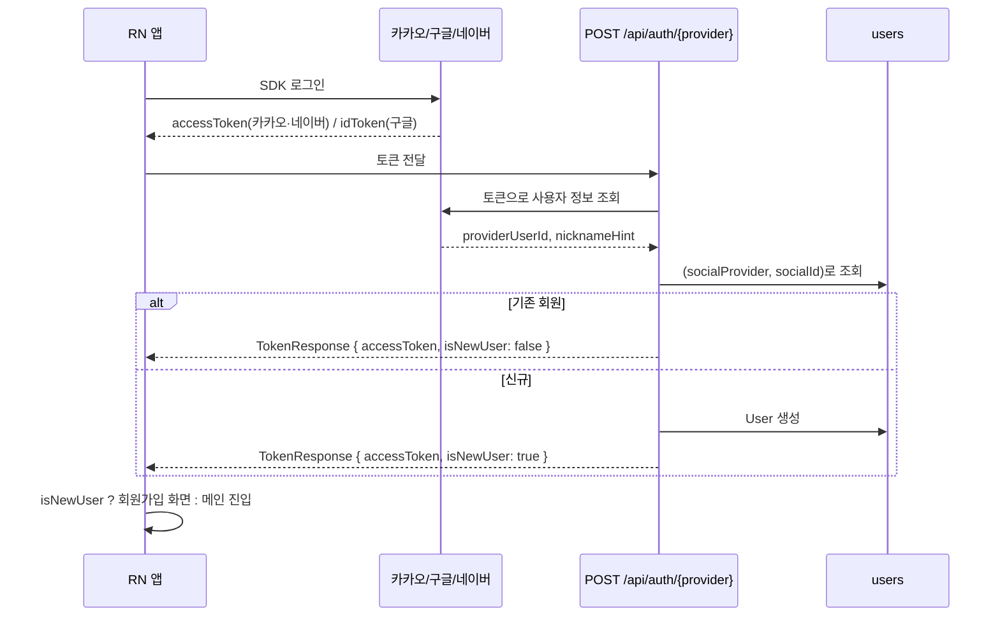
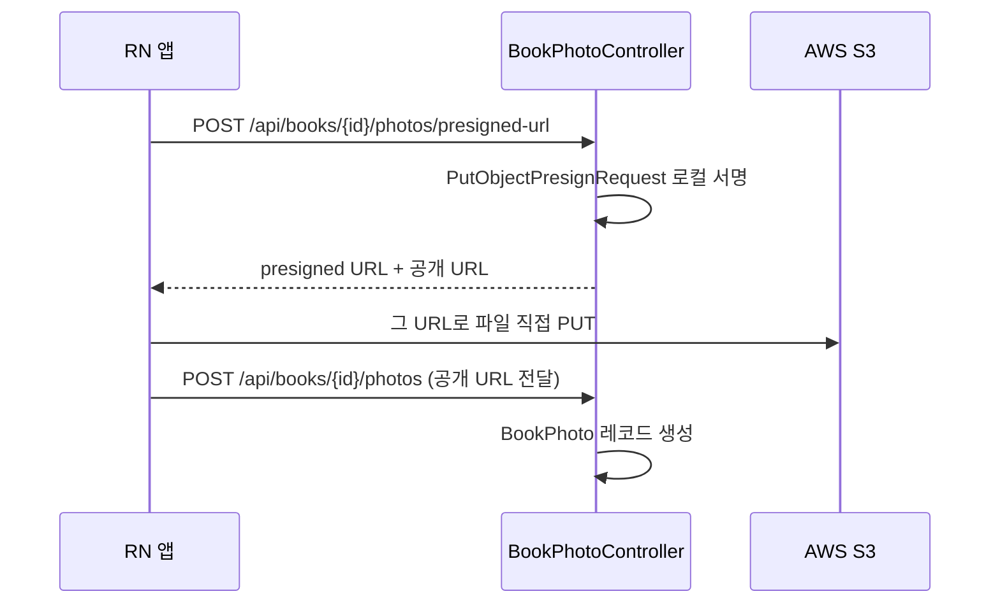
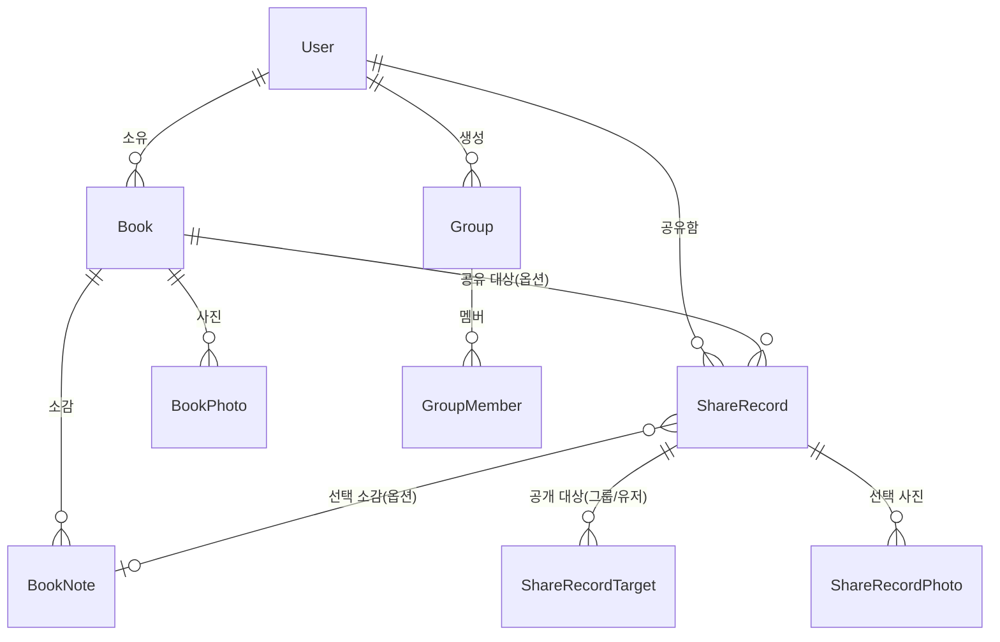

# 콩닥책닥 백엔드 아키텍처

> **v1 · 기준 커밋 `74974fe` (2026-09-09)** · 이전 개정 2026-08-29
> 범위: `backend/` (Spring Boot) — 프론트엔드/디자인은 참고로만 언급
> 진행률·미연동 현황은 이 문서가 아니라 [`../연동매트릭스_v1.md`](../연동매트릭스_v1.md)를 봅니다.

## 1. 기술 스택

| 영역 | 선택 |
|---|---|
| 프레임워크 | Spring Boot 3.2.5, Java 17, Gradle (Kotlin DSL) |
| 패키지 루트 | `com.kongdakchaekdak` (2026-08-28에 `com.bookflex`에서 전환) |
| DB | MySQL 8.0 (docker-compose / 운영), H2 인메모리 (`local`·`test` 프로필) |
| 인증 | JWT (jjwt 0.12.5) + 소셜 3사 — 이메일/비밀번호 로그인 없음 |
| 이미지 | AWS SDK 2.47.4, S3 presigned URL (서버가 파일을 중계하지 않음) |
| 공개 공유 웹뷰 | Thymeleaf 서버 렌더링 (별도 서비스 없음) |
| API 문서 | springdoc-openapi 2.5.0 (`/swagger-ui.html`) |
| CI | GitHub Actions — `backend/**` 변경 시 `./gradlew test` |
| 배포 목표 | Railway (`PORT`/`DB_HOST`/`DB_PORT`/`DB_NAME` 환경변수 분리 완료) |

로컬 개발용으로 `bootRun`이 `backend/.env`를 읽어 프로세스 환경변수로 넘깁니다. 소셜 로그인 Client ID 같은 값을 `application.yml`의 `${KAKAO_CLIENT_ID:}` 플레이스홀더가 그대로 읽습니다. 필요한 키 목록은 `.env.example`에 있고, `.env`는 커밋되지 않습니다.

## 2. 시스템 위치



도서 검색은 앱이 알라딘/카카오 API를 직접 호출하므로 백엔드에 해당 도메인이 없습니다.

## 3. 패키지 구조

```
com.kongdakchaekdak
├── domain/
│   ├── auth/        AuthController · AuthService · SocialAuthService
│   │   └── oauth2/  Kakao·Google·Naver Client + Properties, SocialUserInfo, OAuth2Config
│   ├── user/        회원 CRUD, 관심분야, lastLoginAt
│   ├── book/        독서 기록 CRUD, 상태(READING/DONE)
│   ├── booknote/    책 소감 (한 책에 여러 개)
│   ├── bookphoto/   책 사진 (S3 presigned 2단계)
│   ├── group/       독서모임 + 멤버
│   ├── share/       ShareRecord / Target / Photo + 공개 웹뷰
│   ├── dashboard/   독서 통계 실시간 집계
│   └── common/      Genre, GenreConverter
├── common/
│   ├── exception/   도메인 예외 7종 + ErrorResponse + GlobalExceptionHandler
│   ├── health/      HealthController
│   └── logging/     LogType · AuditLogger · SecurityEventLogger · RequestTraceFilter
├── security/        JwtProvider · JwtAuthenticationFilter · EntryPoint · SecurityConfig · JwtProperties
└── config/          S3Config · S3Properties · OpenApiConfig · PublicWebConfig · PublicWebProperties
```

Java 파일 119개. 각 도메인은 Controller → Service → Repository의 같은 계층 구조를 따르고, DTO는 도메인별 `dto/` 하위에 둡니다.

`Genre`가 `domain/common/`에 있는 이유는 `user.interests`와 `book.genre`가 같은 열거형을 공유하기 때문입니다. 값은 **6개 닫힌 집합**입니다 — 소설, 에세이, 자기계발, 인문, 과학, 경제·경영. 자유 텍스트나 "기타"가 없다는 점이 프론트 장르 색 매핑의 전제이기도 합니다.

## 4. 엔드포인트

| 컨트롤러 | 베이스 | 엔드포인트 |
|---|---|---|
| `AuthController` | `/api/auth` | `POST /kakao` `POST /google` `POST /naver` · `GET /me` |
| `UserController` | `/api/users` | `POST` · `GET` · `GET /{id}` · `PATCH /{id}` · `DELETE /{id}` |
| `BookController` | `/api/books` | `POST` · `GET` · `GET /{id}` · `PUT /{id}` · `PATCH /{id}/complete` · `DELETE /{id}` |
| `BookNoteController` | `/api/books/{bookId}/notes` | `POST` · `GET` · `PATCH /{noteId}` · `DELETE /{noteId}` |
| `BookPhotoController` | `/api/books/{bookId}/photos` | `POST /presigned-url` · `POST` · `GET` · `DELETE /{photoId}` |
| `GroupController` | `/api/groups` | `POST` · `GET` · `GET /{id}` · `PATCH /{id}` · `DELETE /{id}` · `GET·POST /{id}/members` · `DELETE /{id}/members/{userId}` |
| `ShareRecordController` | `/api/share-records` | `POST` · `GET` · `DELETE /{id}` |
| `DashboardController` | `/api/dashboard` | `GET` |
| `PublicShareController` | `/public/share` | `GET /{token}` (인증 불필요) |
| `HealthController` | — | `GET /health` |

합계 37개입니다. 알림·독서 진행률·Apple 로그인은 v1 출시 범위에 포함됐지만 아직 구현되지 않았습니다(연동매트릭스 A표 분모 42의 나머지).

**소유자 검증 패턴은 도메인 전체에서 동일합니다.** 쓰기(수정/삭제)는 본인 소유가 아니면 `ForbiddenException`(403)으로 거부하고, **조회는 의도적으로 열어둡니다** — 남의 독서 기록을 구경하는 것 자체가 이 앱의 기능이기 때문입니다.

## 5. 인증



**서버가 인가 코드를 교환하지 않습니다.** 앱이 이미 받아온 토큰으로 "누구세요?"만 묻기 때문에 서버에 Client Secret이 필요 없습니다. 구글만 `aud` 클레임을 우리 Client ID와 대조해 위조 토큰을 걸러냅니다.

`TokenResponse.isNewUser`가 온보딩 분기의 전부입니다. 신규 가입 시 닉네임은 카카오/네이버가 제공자 프로필 닉네임을, 없으면 랜덤을 씁니다.

> **구글은 닉네임 자리에 이메일 주소가 들어갑니다.** `GoogleOAuthClient`가 ID 토큰의 `name`이 아니라 `email` 클레임을 `SocialUserInfo`에 담습니다. 회원가입 화면에서 닉네임이 필수 입력이라 사용자가 그 자리에서 고칠 수 있지만, 근본 수정은 되지 않았습니다.

새 제공자를 붙이는 비용은 낮습니다. `SocialUserInfo` / `SocialAuthService` 추상화 뒤에 `KakaoOAuthClient`·`GoogleOAuthClient`·`NaverOAuthClient`가 같은 패턴으로 놓여 있어서, Apple 로그인도 `AppleOAuthClient` + `AppleOAuthProperties` + 엔드포인트 하나면 됩니다.

## 6. 이미지 업로드



서버는 파일 바이트를 한 번도 거치지 않습니다. presigned URL 발급은 순수 로컬 서명 연산이라 **AWS로 네트워크 요청조차 나가지 않습니다** — 그래서 `S3Client`는 만들지 않고 `S3Presigner`만 씁니다.

`S3Presigner` 빈은 자격증명이 없어도 서버가 기동 실패하지 않도록 `@Lazy` 처리되어 있습니다. 주의할 점은 **`S3Config`의 빈 정의뿐 아니라 `BookPhotoService` 생성자 파라미터에도 `@Lazy`를 붙여야** 실제로 지연된다는 것입니다(BUG-20260827-03). 자격증명이 없는 환경에서는 `ImageStorageUnavailableException`으로 떨어집니다.

## 7. 공개 공유 웹뷰

`ShareRecord` 생성 시 항상 `public_token`(UUID)이 발급되고, 로그인 없이 `/public/share/{token}`으로 열람할 수 있습니다.

`PublicShareViewService`는 **엔티티를 절대 템플릿에 넘기지 않고** 완전히 평탄화한 `PublicShareView` 레코드로 변환합니다. 뷰 렌더링 중 지연 로딩이 터지는 문제를 구조적으로 차단하기 위한 것입니다.

책 공유는 표지·제목·선택 사진·선택 소감·완독 기간을 보여주고, 대시보드 공유는 **공유 시점에 스냅샷으로 얼려 저장한** JSON(`dashboard_snapshot`)을 보여줍니다. 나중에 데이터가 바뀌어도 공유 당시 숫자가 그대로 남게 하려는 의도적 설계입니다.

## 8. 도메인 모델



테이블명 회피 두 건이 있습니다 — `User`는 `@Table(name="users")`, `Group`은 `@Table(name="groups")`. 둘 다 MySQL 예약어입니다.

`User.interests`는 `@ElementCollection`으로 조인 테이블 `user_interests`에 저장되는 `Set<Genre>`입니다. `lastLoginAt` 컬럼도 있습니다.

**`ShareRecord.user_id`, `ShareRecordPhoto`, `ShareRecord.book_note_id`, `user_interests`는 원본 테이블정의서에 없던 것들입니다.** 구현하며 실용적 필요에 따라 추가됐고, `독서기록앱_테이블정의서.xlsx` 반영이 밀려 있습니다.

## 9. 횡단 관심사

**로깅** — `LogType` 5종(ACCESS/SECURITY/AUDIT/ERROR/APPLICATION)을 파일로 나누지 않고 stdout + MDC(`traceId`/`logType`)로 구분합니다. Railway 컨테이너 파일시스템이 휘발성이라 파일 appender는 `local` 프로필에서만 켭니다. `RequestTraceFilter`가 Security 필터체인보다 먼저 실행되며 요청마다 traceId를 발급합니다.

**예외 처리** — `GlobalExceptionHandler`가 도메인 예외(404/400/401/403/409)와 `HttpMessageNotReadableException`(잘못된 enum 값 등 → 400 `MALFORMED_REQUEST`)을 공통 `ErrorResponse` JSON으로 변환합니다. catch-all 핸들러가 있어 미처리 예외도 Whitelabel 페이지 대신 같은 포맷의 500으로 나갑니다.

**enum ↔ JSON 계약** — API 계약과 DB 매핑을 분리합니다. `@JsonValue`/`@JsonCreator`가 JSON 표현을, `@Converter(autoApply=true)`가 컬럼 매핑을 독립적으로 담당합니다.

| enum | JSON 표현 |
|---|---|
| `Genre` | 한글 라벨 그대로 (`"소설"`) |
| `ShareType` · `ShareScope` · `SharePlatform` · `ShareTargetType` | 소문자 영문 |
| `DashboardPeriod` | 소문자 영문 (2026-08-31 통일) |

`DashboardPeriod`만 이력이 하나 붙습니다. 2026-08-28에 다른 enum들을 소문자로 통일할 때 빠져 있어서, 같은 요청 바디 안에서 `shareType`은 소문자인데 `dashboardPeriod`만 대문자여야 하는 상태였습니다. 8-31에 정리했고 **이제는 대문자를 보내면 400**입니다. 단, `GET /api/dashboard?period=`는 컨트롤러가 문자열을 직접 받아 `toUpperCase()` 후 `valueOf`하는 별도 경로라 원래부터 대소문자를 가리지 않습니다.

## 10. 인프라

- **로컬** — `docker-compose.yml`(MySQL 8.0, DB명 `kongdakchaekdak`) 또는 `local` 프로필(H2 인메모리, Docker 불필요).
- **테스트** — `test` 프로필, H2 인메모리. 13개 파일 83개 테스트.
- **CI** — `.github/workflows/backend-test.yml`. `backend/**` push/PR마다 `./gradlew test`.
- **배포** — Railway 목표. `server.port`(`${PORT:8080}`), `datasource.url`(`DB_HOST`/`DB_PORT`/`DB_NAME` 분리), Gradle Wrapper 커밋 완료. `ddl-auto: update`로 스키마를 JPA가 관리합니다.

DB명을 `reading_record_app` → `kongdakchaekdak`으로 바꾼 적이 있어, 그 이전에 만든 로컬/Railway DB는 고아가 됩니다. 기존 환경에서 올릴 때는 마이그레이션이 필요합니다.
