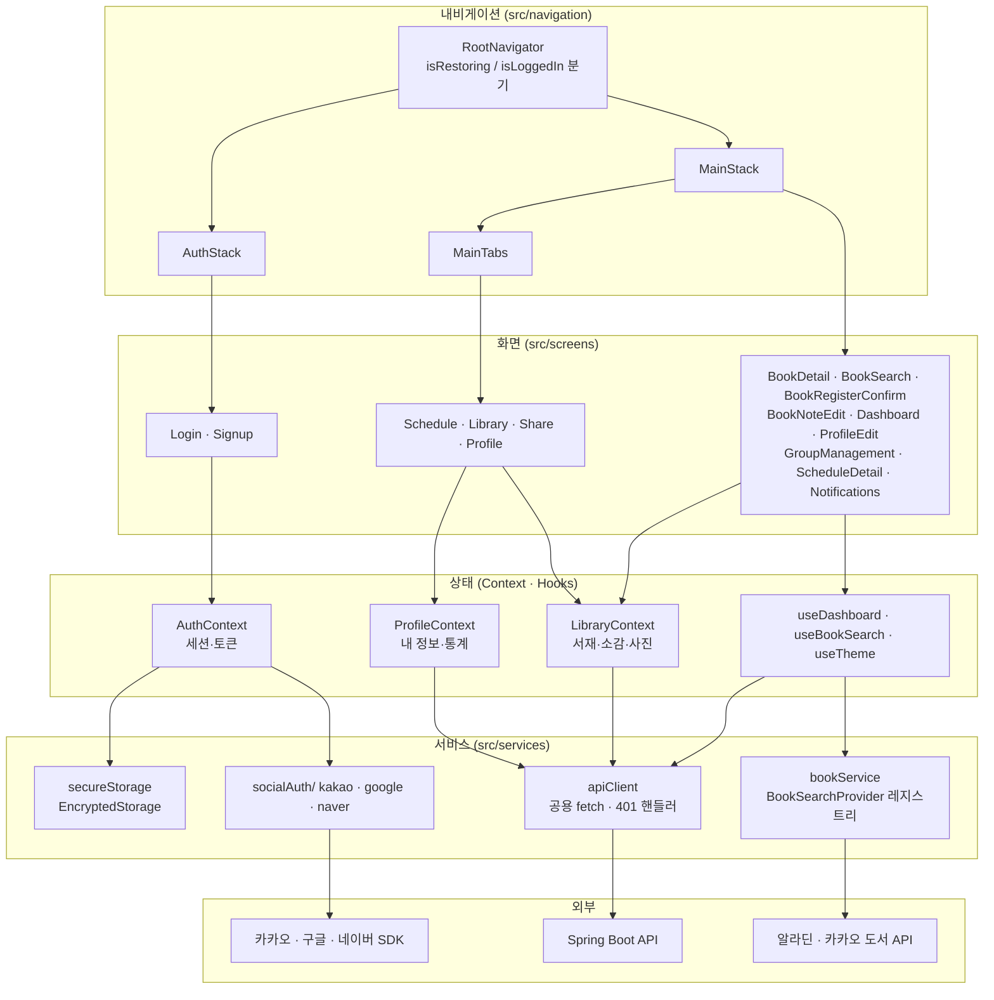

# 콩닥책닥 프론트엔드 아키텍처

> **v1 · 기준 커밋 `74974fe` (2026-09-09)** · 이전 개정 2026-08-31
> 범위: `frontend/` (React Native 0.74 + TypeScript) — 백엔드/디자인은 참고로만 언급
> 진행률·미연동 현황은 이 문서가 아니라 [`../연동매트릭스_v1.md`](../연동매트릭스_v1.md)를 봅니다.

## 0. 요약

화면(Screens) → 내비게이션 → 상태(Context·Hooks) → 서비스(Services) → 백엔드 API 순서의 레이어 구조를 따르는 React Native 단일 앱입니다. 화면 15개, 하단 탭 4개, 스택 라우트 10개가 등록되어 있습니다.

이전 개정 이후 구조적으로 달라진 것은 세 가지입니다. **공용 HTTP 클라이언트(`apiClient`)가 생겨** 서비스들이 그 위에 올라갔고, **세션이 암호화 스토리지에 영속화**되어 앱을 껐다 켜도 로그인이 유지되며, **Context가 3층(Auth / Profile / Library)으로 분리**되어 화면이 mock 배열 대신 Context를 통해 데이터를 받습니다.

데이터 출처는 화면마다 다릅니다. 인증·프로필·서재·대시보드는 실제 API를, 일정 상세·알림·그룹 관리·공유 대상 목록은 아직 `src/mocks/`를 씁니다.

## 1. 레이어 구조



## 2. 화면 인벤토리

15개 화면 전부 내비게이터에 등록되어 있습니다. (이전 개정에서 "고아 상태"로 적혔던 `BookSearchScreen`은 `MainStack`에 정상 등록됐습니다.)

| 화면 | 파일 | 라우트 | 데이터 출처 |
|---|---|---|---|
| 로그인 | `LoginScreen.tsx` | `AuthStack/Login` | `authApi` (실연동) |
| 회원가입 | `SignupScreen.tsx` | `AuthStack/Signup` | `AuthContext` |
| 일정(홈) | `ScheduleScreen.tsx` | `Tabs/Schedule` | `ProfileContext` |
| 서재 | `LibraryScreen.tsx` | `Tabs/Library` | `LibraryContext` (실연동) |
| 공유 | `ShareScreen.tsx` | `Tabs/Share` | `LibraryContext` + `MOCK_SHARE_GROUPS` |
| 프로필 | `ProfileScreen.tsx` | `Tabs/Profile` | `AuthContext` · `ProfileContext` (실연동) |
| 책 상세 | `BookDetailScreen.tsx` | `MainStack/BookDetail` | `LibraryContext` (실연동) |
| 책 검색 | `BookSearchScreen.tsx` | `MainStack/BookSearch` | `useBookSearch` → 알라딘/카카오 |
| 책 등록 확인 | `BookRegisterConfirmScreen.tsx` | `MainStack/BookRegisterConfirm` | `LibraryContext` |
| 소감 작성·수정 | `BookNoteEditScreen.tsx` | `MainStack/BookNoteEdit` | `LibraryContext` |
| 대시보드(Recap) | `DashboardScreen.tsx` | `MainStack/Dashboard` | `useDashboard` (실연동) |
| 프로필 편집 | `ProfileEditScreen.tsx` | `MainStack/ProfileEdit` | `ProfileContext` (실연동) |
| 그룹 관리·공유 이력 | `GroupManagementScreen.tsx` | `MainStack/GroupManagement` | mock |
| 일정 상세 | `ScheduleDetailScreen.tsx` | `MainStack/ScheduleDetail` | mock |
| 알림 목록 | `NotificationScreen.tsx` | `MainStack/Notifications` | mock |

## 3. 내비게이션

`src/navigation/`이 4개 파일로 나뉘어 있습니다.

- **`RootNavigator`** — `AuthContext`의 `isRestoring` / `isLoggedIn`을 보고 분기합니다. 부팅 직후 저장된 세션을 복원하는 동안이 `isRestoring`이고, 이 상태를 두지 않으면 복원 성공 직전에 로그인 화면이 한 번 번쩍이게 됩니다.
- **`AuthStack`** — `Login` → `Signup`.
- **`MainTabs`** — 일정 / 서재 / 공유 / 프로필 4탭. 아이콘은 `components/TabBarIcons.tsx`.
- **`MainStack`** — 탭 위에 전체화면으로 push되는 10개 라우트. 와이어프레임상 상세 화면에는 탭바가 없어야 하므로 탭 안이 아니라 위에 쌓습니다.

라우트 파라미터 타입은 `navigation/types.ts` 한 곳에 모여 있고, 각 라우트에 어느 화면의 어느 버튼에서 진입하는지가 주석으로 붙어 있습니다. `Share` 탭만 파라미터가 `{bookId?: string} | undefined`인데, 탭을 직접 누르는 경로와 책 상세의 "이 책 공유하기"로 들어오는 경로가 함께 있기 때문입니다.

## 4. 상태 관리

### 4.1 AuthContext — 세션과 토큰

`accessToken`, `sessionUser`, `isLoggedIn`, `isRestoring`을 들고 있습니다.

**세션은 영속화됩니다.** `react-native-encrypted-storage`에 `@kongdakchaekdak/accessToken` 키로 저장하고, 부팅 시 복원한 뒤 `GET /api/auth/me`로 검증합니다. 검증에 실패하면 저장된 토큰을 폐기하고 로그인 화면으로 돌립니다. 다만 네트워크 오류(`ApiError.status === 0`)는 토큰 무효와 구분해서 세션을 유지합니다 — 지하철에서 앱을 열었다고 로그아웃시키면 안 되기 때문입니다.

> 이전 개정에는 "세션 영속화가 없음"으로 적혀 있었습니다. 2026-09-08 구현됐고 실기기 검증(S1-1)까지 통과했습니다. AsyncStorage가 아니라 EncryptedStorage이며, 네이티브 모듈이라 **JS 번들 갱신만으로는 반영되지 않고 재빌드가 필요**합니다.

### 4.2 ProfileContext — 내 정보와 통계

`userApi.getMe()` / `updateUser()` + `profileStatsApi.fetchProfileStats()`를 감쌉니다. 초기값이 mock이 아니라 `EMPTY_PROFILE`인 것이 설계 포인트입니다 — 부팅 시점에 `AuthProvider`가 이미 세션 검증으로 사용자 정보를 받아오므로, 여기서 다시 mock을 채웠다가 덮어쓰면 화면이 두 번 바뀝니다.

### 4.3 LibraryContext — 서재

`libraryApi`(책·소감·사진)를 감싸고 `AuthContext`(사용자 ID)와 `ProfileContext`에 의존합니다. 책 목록 조회, 등록, 완독 처리, 삭제, 소감 CRUD, 사진 조회를 한 곳에서 관리합니다.

### 4.4 훅

- **`useDashboard`** — 기간(`month`/`quarter`/`year`) 상태 + `GET /api/dashboard?period=&date=` 호출 + 로딩/에러/재시도. `date`는 현재 달(`yyyy-MM`)을 보내고 그 달이 속한 기간은 백엔드가 계산합니다.
- **`useBookSearch`** — `bookService.search(query, providerId?)` 호출과 로딩/에러 상태.
- **`useTheme`** — 라이트/다크 팔레트 전환.

## 5. 서비스 레이어

### 5.1 공용 클라이언트 — `apiClient.ts`

모든 인증 API가 통과하는 단일 함수 `apiFetch<T>(path, init)`입니다.

- 베이스 URL은 `react-native-config`의 `API_BASE_URL`, 없으면 `http://10.0.2.2:8080`(안드로이드 에뮬레이터에서 호스트를 가리키는 주소).
- 토큰이 설정돼 있으면 `Authorization: Bearer` 자동 부착 (`setApiAccessToken`).
- **401이면 등록된 핸들러를 호출**해 앱 전역을 로그아웃시킵니다 (`registerUnauthorizedHandler`). 화면마다 401을 처리하지 않기 위한 장치입니다.
- 실패는 `status`를 가진 `ApiError`로 정규화합니다. **네트워크 자체가 실패하면 `status: 0`** — 이 규약 때문에 "서버가 거절함"과 "서버에 닿지 못함"을 호출부에서 구분할 수 있습니다(§4.1 세션 복원, `components/NetworkError.tsx` 배너).
- `204 No Content`는 본문 파싱을 건너뜁니다.

### 5.2 저장소 — `secureStorage.ts`

`SecureStorage` 인터페이스 뒤에 `react-native-encrypted-storage`를 두었습니다. 인터페이스로 감싼 덕분에 테스트에서는 `__mocks__/react-native-encrypted-storage.js`로 교체됩니다(패키지가 공식 mock을 제공하지 않아 직접 둔 것).

### 5.3 소셜 로그인

| 제공자 | 파일 | SDK | 서버로 보내는 값 |
|---|---|---|---|
| 카카오 | `socialAuth/kakaoAuth.ts` | `@react-native-seoul/kakao-login` 6.0.4 | `accessToken` |
| 네이버 | `socialAuth/naverAuth.ts` | `@react-native-seoul/naver-login` 5.0.1 | `accessToken` |
| 구글 | `socialAuth/googleAuth.ts` | `@react-native-google-signin/google-signin` 16.1.4 | `idToken` |

셋 다 `authApi.socialLogin()`을 통해 `POST /api/auth/{provider}`로 보내고, 응답 `TokenResponse.isNewUser`로 회원가입 화면 진입 여부를 분기합니다.

카카오 SDK는 사용자 취소를 구분하는 전용 에러 코드가 없어 취소도 "로그인 실패"로 처리됩니다. 구글·네이버는 취소 시 조용히 로그인 화면으로 돌아옵니다. SDK 차이에서 오는 것이라 앱에서 통일할 수 없습니다.

### 5.4 도서 검색 — `bookService`

`BookSearchProvider` 인터페이스(`providerId` + `search(query)`)를 `AladinApi`와 `KakaoApi`가 구현하고, `bookService`가 `Map<BookProviderId, provider>`로 들고 있는 레지스트리 구조입니다.

**두 API 결과를 병합하지 않습니다.** `search(query, providerId?)`는 지정된 provider **하나만** 호출하고, 미지정 시 기본값은 알라딘입니다. 새 도서 API를 붙이려면 인터페이스를 구현한 클래스 하나를 만들어 `bookService` 생성자에 등록하면 되고, 화면·훅 코드는 손대지 않습니다.

### 5.5 백엔드 API 래퍼

| 파일 | 감싸는 엔드포인트 |
|---|---|
| `authApi.ts` | `POST /api/auth/{kakao,google,naver}` |
| `userApi.ts` | `GET /api/auth/me`, `PATCH /api/users/{id}` |
| `libraryApi.ts` | `/api/books` 및 하위 `notes`·`photos` (사진은 presigned URL 2단계) |
| `profileStatsApi.ts` | 전용 엔드포인트 없음 — 아래 참고 |

`profileStatsApi`는 통계 전용 API가 없어서 `GET /api/books?status=done`과 `GET /api/share-records` 두 개를 `Promise.allSettled`로 묶어 세는 방식입니다. **한쪽이 실패해도 프로필 전체를 실패시키지 않고** 실패한 카운트만 0으로 두고 로그를 남깁니다 — 통계는 화면의 보조 정보이기 때문입니다. 남의 프로필 통계가 필요해지는 시점에는 `UserResponse`에 필드를 추가하는 쪽으로 갈아타야 합니다(현재 `/api/share-records`는 내 것만 반환).

## 6. 주요 데이터 타입

```ts
// 인증
interface TokenResponse {
  accessToken: string;
  tokenType: 'Bearer';
  expiresIn: number;
  isNewUser: boolean;   // true=신규가입 → Signup, false=기존 → 메인
}

// 서재 (libraryApi)
type BookStatusResponse = 'READING' | 'DONE';

// 대시보드
type DashboardPeriod = 'month' | 'quarter' | 'year';        // 앱 내부
type DashboardPeriodResponse = 'MONTH' | 'QUARTER' | 'YEAR'; // 응답 필드

interface DashboardResponse {
  userId: number;
  period: DashboardPeriodResponse;
  periodLabel: string;
  startDate: string;
  endDate: string;
  completedBookCount: number;
  totalPagesRead: number;
  genreRatios: GenreRatioDto[];      // { genre, count, ratio }
  monthlyTrend: MonthlyTrendDto[];   // { yearMonth, completedCount }
  highlights: DashboardHighlights;   // topGenre · longestReadBook · fastestReadBook
  recommendedCaption: string;
}
```

`GET /api/dashboard`의 `period` 쿼리 파라미터는 대소문자를 가리지 않지만, **대시보드 공유(`POST /api/share-records`)의 `dashboardPeriod` 필드는 소문자만 받습니다.** 백엔드가 2026-08-31에 다른 enum들과 계약을 통일하면서 정해진 것으로, 두 경로가 서로 다른 규칙을 쓰는 게 아니라 전자만 별도 로직이라 관대한 것입니다.

## 7. 테마 시스템

- **`theme/colors.ts`** — `ThemeColors` 인터페이스 37개 키. `p50~p900`(쑥송편 그린 램프), `n50~n900`(뉴트럴), `success`/`warning`/`error`/`info`, **`chart1~chart6`**, `surface`, `accentSolidBg`, `onAccentSolid`, `warnBg`/`warnText`, `hairline`.
- **`theme/typography.ts`** — `TypographyVariant`별 `TextStyle` 맵.
- **`constants/genreColors.ts`** — **장르 6개가 각각 고정색을 갖습니다.** 순위가 아니라 장르 이름이 색을 결정하므로, 도넛차트에서 소설은 항상 같은 색입니다.

> 이전 개정의 "1위=chart1, 2위=chart2, 4위 이하는 `n200` 기타" 규칙은 폐기됐습니다. 과학·경제/경영이 `chart5`/`chart6`을 받으면서 6개 장르가 전부 고유색을 갖게 됐고, `Genre`가 자유 텍스트 없는 닫힌 열거형이라 "기타" 처리 자체가 필요 없어졌습니다.

같은 장르라도 **쓰이는 자리마다 색 조합이 다릅니다.** 도넛차트는 `chart1~6` 토큰을 그대로, 선택 칩(`GENRE_CHIP_COLORS`)은 배경이 장르 고유색, 서재 배지(`GENRE_BADGE_COLORS`)는 옅은 틴트 배경에 진한 텍스트(다크모드 반전)입니다. 셋은 서로 재사용하지 않습니다.

## 8. 테스트

Jest + `react-native` 프리셋. `frontend/__tests__/`에 8개 파일 37개 케이스가 있고, CI(`.github/workflows/frontend-test.yml`)가 `frontend/**` 변경 시 실행합니다.

`jest.config.js`의 `moduleNameMapper`에 우회 3건이 있습니다 — `lucide-react-native`의 ESM 빌드를 CJS로 강제 매핑, AsyncStorage와 EncryptedStorage를 인메모리 mock으로 대체. 앞의 것은 프리셋이 `.mjs`를 변환하지 못해서, 뒤의 둘은 네이티브 모듈이 테스트 환경에 링크되지 않아서입니다.

## 9. 구조상 남은 부채

기능 미완성 항목이 아니라 **구조가 어긋나 있는 것들**만 적습니다. 기능 현황은 연동매트릭스를 봅니다.

- **`src/mocks/libraryBooks.ts`가 타입 모듈 겸용입니다.** `LibraryBook`·`LibraryNote`·`LibraryPhoto`·`BookStatus`가 여기 있어서, 실연동이 끝난 `LibraryScreen`·`BookDetailScreen`이 여전히 `mocks/`를 import합니다. 타입은 `src/types/`로 옮기는 게 맞습니다.
- **`theme/typography.ts`의 `FONT_FAMILY`가 미지정이라 시스템 폰트로 폴백 중입니다.** Pretendard 번들링이 남아 있습니다.
- **일정·알림·그룹 관리는 백엔드 엔드포인트 자체가 없습니다.** 프론트의 mock은 그래서 남아 있는 것이고, 프론트만으로는 걷어낼 수 없습니다(연동매트릭스 A표 참고).
